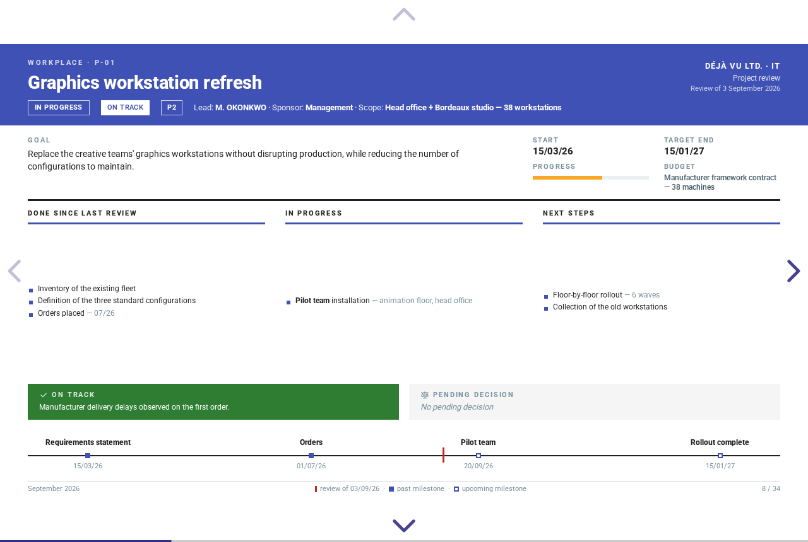

# project-review

**A complete project-portfolio review app in a single HTML file — no server,
no install, works from `file://`.**

[](https://github.com/fcabouat/project-review/actions/workflows/ci.yml)
[](LICENSE)

A portfolio — projects, categories, decisions, milestones — is entered once in
the editor; the entire monthly deck (dashboards, recap table, project sheets,
decisions, archives) is derived from it and regenerated on demand. No slide is
ever edited by hand.

<!-- This picture, and the fourteen of `docs/images/`, are remade by one
     command: `node scripts/stage-doc-images.mjs` — see that script's header. -->


## Contents

- [Try it](#try-it)
- [Highlights](#highlights)
- [Architecture](#architecture)
- [Quick start (from source)](#quick-start-from-source)
- [Contributing](#contributing)
- [Documentation](#documentation)
- [License](#license)

## Try it

- **[Live demo](https://fcabouat.github.io/project-review/demo/project-review.html?sample)** —
  opens on a 20-project sample; switch French/English from the top bar.
- **[Download `project-review.html`](https://fcabouat.github.io/project-review/demo/project-review.html)** —
  download → double-click → it works. One file, ~1.7 MB, everything inlined;
  it runs offline, from a USB stick, or as an email attachment. The app
  itself carries no content: two sample portfolios sit next to it
  ([English](https://fcabouat.github.io/project-review/demo/sample-portfolio.en.json),
  [French](https://fcabouat.github.io/project-review/demo/sample-portfolio.fr.json)) —
  import one like any portfolio file.
- **[Project site](https://fcabouat.github.io/project-review/)** — demo,
  docs, component catalog and API reference in one place.

## Highlights

- **Single file, local-first** — 100 % client-side, runs from `file://`; the
  data never leaves the browser (localStorage persistence, opt-out), and no
  third party is contacted for anything, fonts included.
- **Event-sourced editing** — every change is an invertible domain event;
  undo/redo across the last 500 actions, with a business-worded history view.
- **Multi-user without a server** — colleagues edit their own projects in
  their own copy (a partial export opens alone in the app); merging their
  contribution back is one undoable import.
- **A pure, zero-dependency core** — the domain, its commands and its laws are
  plain TypeScript with no runtime dependency, at 100 % line coverage — measured
  on every CI run, where the threshold fails the build.
- **Four packages, one-way flow** — boundaries enforced twice: by the
  workspace manifests (a reverse import cannot resolve) and by per-layer
  ESLint restrictions.
- **Bilingual by construction** — French or English auto-detected on first
  launch, switchable live from the top bar; entered content is never
  translated.
- **The organization's identity travels in the file** — logo, typeface and a
  palette of twelve colours ride inside the `.json`, so a portfolio carries
  its house look with no deployment and no network; three slide themes and
  three bundled palettes are there for everyone else.
- **Works on a phone** — below desktop widths the sidebar becomes a drawer,
  forms stack and wide tables scroll inside their own frame; the slideshow
  scales to the screen with a touch-visible exit bar.
- **Accessibility as a target** — WCAG 2.1 AA aimed for and checked by an
  axe-core pass (zero serious/critical across every screen, both schemes, the
  recovery screen and the nine printed style × palette pairs included) and a
  scripted keyboard walk; motion honours `prefers-reduced-motion`. The editor
  holds AA text contrast, and the slides' semantic inks (labels, health and
  risk scales, all three themes) were measured and brought to AA text
  contrast. Where a category tint carries TEXT — the id chips and pills — the
  glyph takes an ink DERIVED from that tint, contracted in OKLCH until it
  clears 4.5:1 on both grounds it sits on (measured floor 4.70:1, over the
  three families' twelve colours and the neutral sentinel): `palettes.css`
  keeps its hexes exactly as the ecosystems it names publish them, and only
  the ink moves. The white text ON a category plane — the divider, the sheet
  rail — was the last exception, and it is closed on paper: every text node of
  the printed deck was composited against its own ground and compared to its
  own threshold, and `flat` and `institutional` come out at ZERO under
  threshold in all three families. `modern`'s cover is the one thing no such
  measurement can judge — its ground is a gradient, and a gradient has no
  single colour to composite against; axe declines it for the same reason. No
  formal RGAA audit.
- **Light and dark editor** — System/Light/Dark reader preference, stored on
  the device, never in the portfolio file; the slides are the artifact and
  stay light in both schemes.
- **Print-perfect A4** — the deck prints one page per slide through the
  browser's dialog; PDF is a print, not an export pipeline.
- **Visual contract** — 73 Storybook stories covering every slide, widget and
  screen, including a fully playable in-memory editor; the toolbar reads any
  of them in three slide themes, three palettes and both schemes.

## Architecture

```
            ┌───────────────────────────────┐
            │              app              │  wiring only: core state bound
            └───────┬───────────────┬───────┘  to runes, adapters injected
                    │               │
     ┌──────────────▼───┐   ┌───────▼──────────┐
     │    components    │   │  infrastructure  │  Svelte views · browser
     └──────────────┬───┘   └───────┬──────────┘  adapters (storage, router…)
                    │               │
            ┌───────▼───────────────▼───────┐
            │             core              │  pure domain — zero dependency,
            └───────────────────────────────┘  no DOM, no clock, embeddable
```

Views render and emit commands, never mutate; adapters implement, never
decide. Inside the core, eight layers stack one way:

`values → model → data → commands → events → projections → services → runtime`

Three laws hold everywhere: **no clock** (the only reference date is the
review date), **total functions** (no domain function throws — the strict
import is the one gate that refuses, exhaustively), **nothing derived is
stored** (the store holds `{ past, present, future }` and nothing else). Each
law is pinned by named tests.

The whole design fits on one page: **[docs/overview.md](docs/overview.md)**.

## Quick start (from source)

```sh
bun install
bun run dev      # editor on the Vite dev server
bun run build    # all deliverables into dist/
```

| Artifact                                 | Contents                                            |
| ---------------------------------------- | --------------------------------------------------- |
| `dist/index.html` + `assets/` + `fonts/` | Static-hosting build (module scripts, lazy chunks)  |
| `dist/project-review.html`               | The deliverable: one multilingual single-file build |

| Script                  | Does                                               |
| ----------------------- | -------------------------------------------------- |
| `bun run dev`           | Vite dev server                                    |
| `bun run test`          | Vitest suite (four projects)                       |
| `bun run test:coverage` | Same suite with coverage and its thresholds        |
| `bun run smoke`         | Playwright smoke, `file://` + http (after a build) |
| `bun run a11y`          | axe-core pass on the built deliverables            |
| `bun run check`         | svelte-check + tsc, per package                    |
| `bun run lint`          | ESLint (incl. boundary rules)                      |
| `bun run format`        | Prettier, write mode                               |
| `bun run knip`          | Unused files/exports/dependencies                  |
| `bun run audit`         | Dependency vulnerability audit                     |
| `bun run docs:api`      | TypeDoc API reference                              |
| `bun run docs:notices`  | Regenerate `THIRD-PARTY.md` from the notices table |
| `bun run docs:site`     | Assemble the GitHub Pages site                     |
| `bun run build`         | Static build + single file                         |
| `bun run storybook`     | Component catalog on port 6006                     |

## Contributing

Two contributions are deliberately cheap:

**Add a display language (~20 minutes).** English is the language of code and
format; a display language is data:

1. `packages/core/src/model/theme.ts` — extend the `Language` union and
   `LANGUAGES`.
2. `packages/core/src/data/catalog.<lang>.ts` — the generated-labels table
   (copy `catalog.en.ts`; `services/i18n.ts` pins all key sets together at
   compile time with `CoversExactly`).
3. `packages/components/src/i18n.ts` — the editor-chrome catalog (same keys,
   one more column).
4. `packages/core/samples/sample-portfolio.<lang>.json` — a sample set, validated
   by the strict parse and the acceptance tests.
5. `docs/user-guide.<lang>.md` — the guide.

**Add a color palette (~1 hour).** A palette is one CSS block — the hour goes
into choosing the twelve values, not into wiring them:

1. `packages/components/src/palettes.css` — add a `[data-palette='<name>']`
   block mapping the 12 generic category colors to hex values.
2. `packages/core/src/model/theme.ts` — extend the `PaletteFamily` union and
   `PALETTES` (this one edit also opens the parse and the command contract:
   both read that list).
3. `packages/core/samples/portfolio.schema.json` — the `settings.theme.palette`
   enum, the published contract outside tooling reads.
4. `packages/components/src/i18n.ts` — one `editor.palette.<name>` label.
5. `packages/components/.storybook/preview.ts` — one toolbar item, so the
   stories can be read under the new family.

The twelve values are the real work: each one carries text (the category pill,
the id chip, the rail, the divider), so measure the ratios against white and
against its own 12 % tint, and keep the twelve far enough apart to be told
one from another. `uniform` is a worked example — its generation rule is
written at the top of its block.

**Add a slide theme (~half a day).** A theme RESTYLES the slides — colors,
surfaces, borders, shadows, typography accents — and never changes their
structure: the layout belongs to the templates' utility classes, which stay
untouched. `flat` and `modern` are the two worked examples, and they differ in
an important way: `flat` needed template arms (it moves the chrome about),
`modern` needed NONE — it restyles the same markup `institutional` renders.
Aim for the second kind; a template arm is a cost every future template pays.

1. `packages/components/src/slides/<name>.css` — a new sheet, every rule nested
   under `:root[data-slide-style='<name>']`, plus its own `@media print` block
   (shadows do not print: restate them as hairlines there). The swap works
   because these theme rules are UNLAYERED and therefore outrank the
   templates' layered Tailwind utilities — keep every rule under the gate.
2. Import the sheet in the three templates that already import `flat.css` —
   `SlideChrome`, `SlideTitle`, `SlideDivider`. Nothing else pulls it into the
   bundle, and a sheet nobody imports is silently inert.
3. `packages/core/src/model/theme.ts` — extend the `ThemeStyle` union and
   `THEME_STYLES` (again, the parse and the command contract follow).
4. `packages/core/samples/portfolio.schema.json` — the `settings.theme.style`
   enum.
5. `packages/components/src/i18n.ts` — one `editor.style.<name>` label.
6. `packages/components/.storybook/preview.ts` — one toolbar item AND the
   decorator's guard, which lists the styles it accepts.

Then the part that actually takes the time. Walk the 34 frames of the deck in
each palette, on screen and in `?print`: nothing may overflow, nothing may be
clipped. Re-measure every ink/ground pair the theme retunes — and expect to
find, as `modern` did, a base rule holding a literal color no theme can reach
(`theme.css` says so where it happens). Leave the health scale and the
progress ramp alone unless you mean to re-check all ten of their pairs.

Before opening a PR, read [docs/overview.md](docs/overview.md) — the
architecture, the three laws and where the guarantees live — and run
`bun run test && bun run check && bun run lint`.

## Documentation

- [docs/overview.md](docs/overview.md) — the application on one page:
  packages, core layers, the edit loop, where the guarantees live
- [User guide](docs/user-guide.md) · [Guide utilisateur](docs/user-guide.fr.md)
- [portfolio.schema.json](packages/core/samples/portfolio.schema.json) — the
  published contract of the portfolio file format
- [THIRD-PARTY.md](THIRD-PARTY.md) — the embedded third-party components and
  their licenses (generated by `bun run docs:notices`)
- `bun run docs:api` — `@project-review/core` API reference into `docs/api/`
- `bun run storybook` — component catalog

## License

MIT — see [LICENSE](LICENSE).

The MIT license covers the software and the assets distributed with it. Logos,
fonts, data and other content imported by users remain subject to their own
rights and are not licensed under it.

Third-party components embedded in the deliverable are listed with their
licenses in [THIRD-PARTY.md](THIRD-PARTY.md) — and in the application itself,
under **About and licenses**, so a file handed on without this repository still
carries them.

Two of the three colour palettes are derived from the Tailwind CSS and
Material Design colour systems, credited above with the rest; the third
(`uniform`) is generated from scratch in OKLCH and owes nothing to anyone.
Any font a deployment serves, any palette or logo a portfolio carries, is the
deployer's own choice and their own licensing question.
