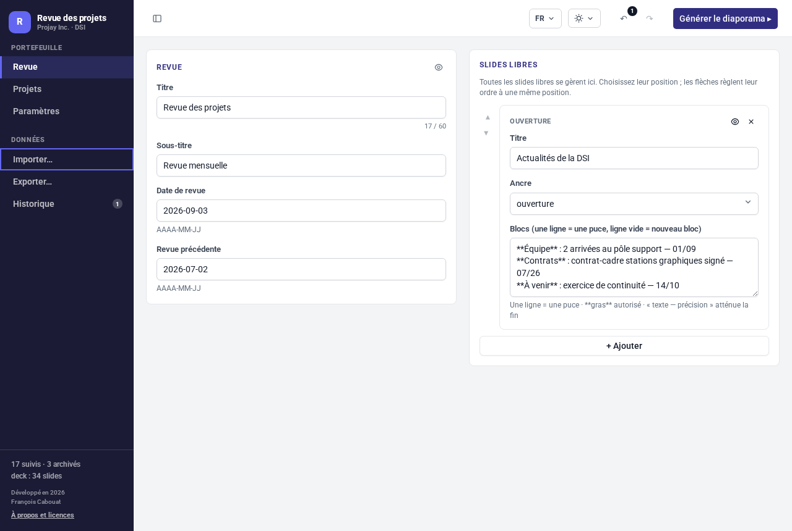
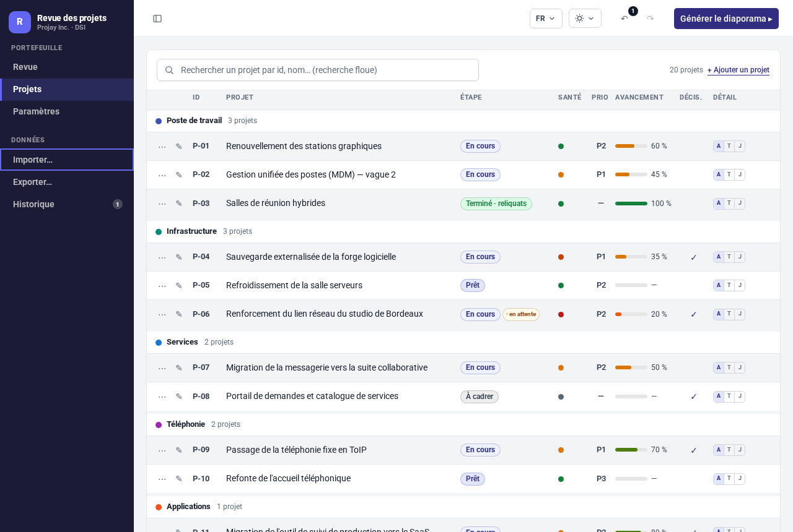
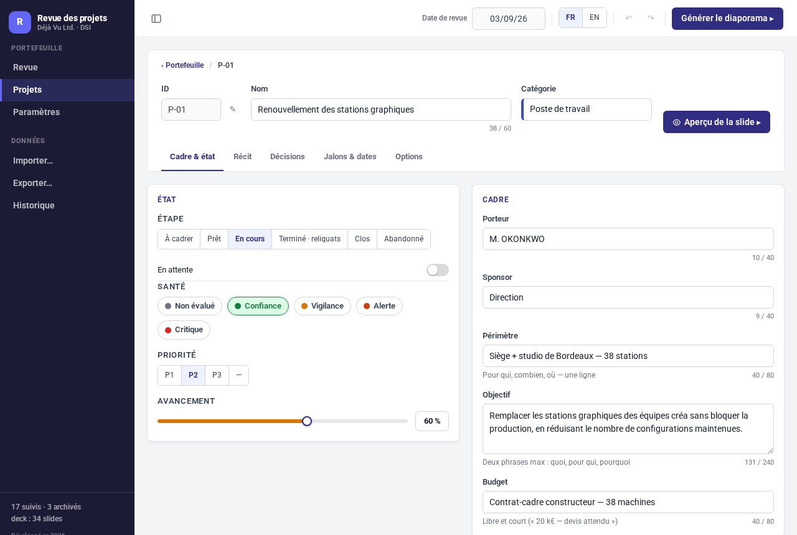
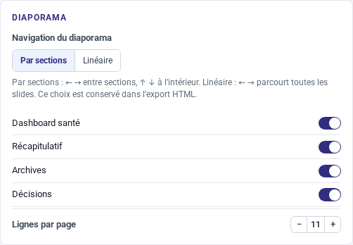
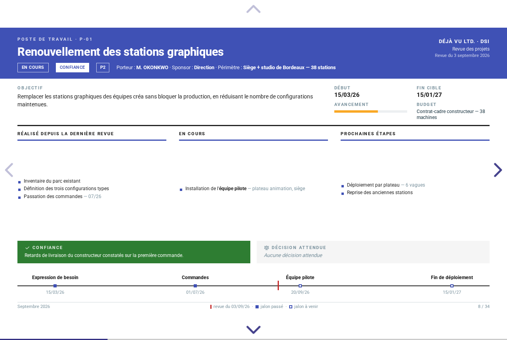
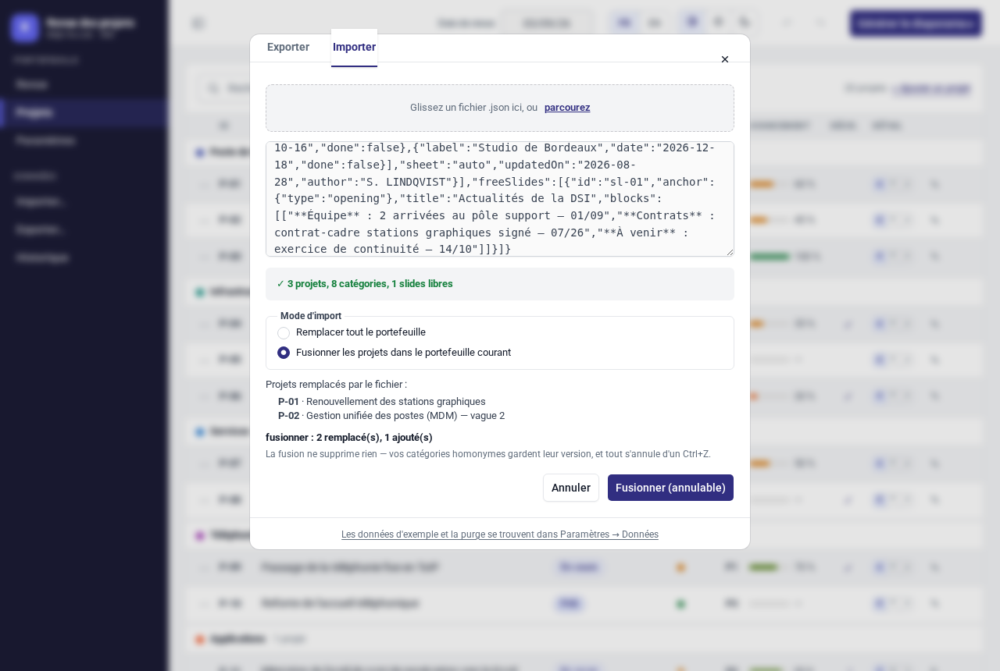
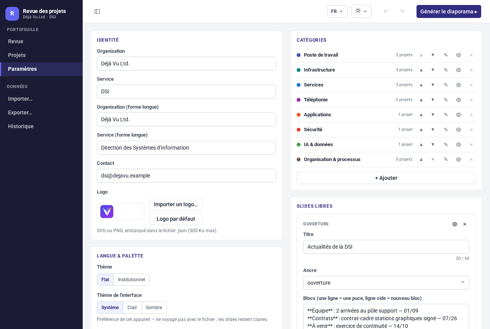
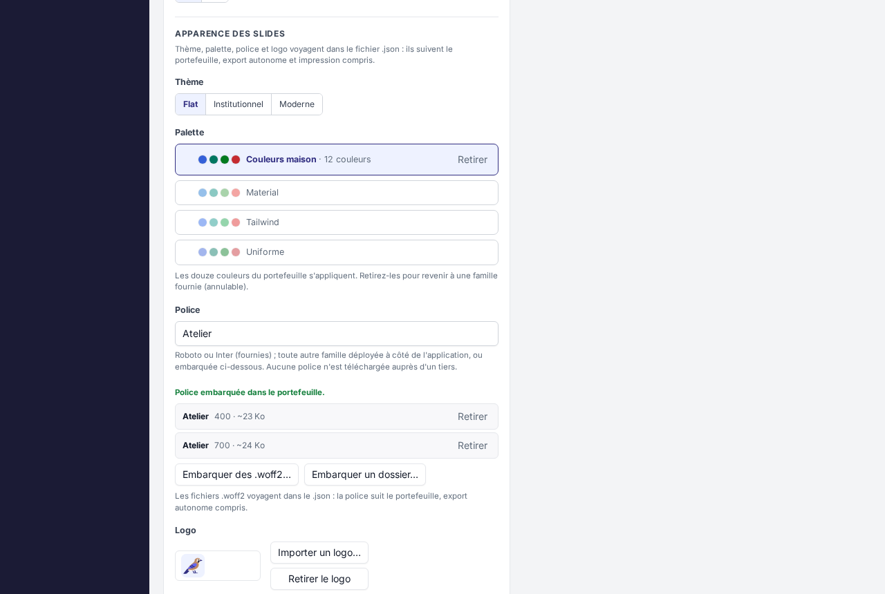

# Guide utilisateur

project-review fait tourner une revue mensuelle de projets à partir d'un seul
portefeuille. On saisit les projets une fois ; tout le diaporama — dashboards,
tableau récapitulatif, fiches projet, décisions, archives — est dérivé de ces
données. Les slides libres portent un récit complémentaire facultatif.

L'application est un seul fichier multilingue : elle démarre dans la langue
du navigateur (français si le navigateur l'annonce, anglais sinon) et change
de langue à tout moment. Le guide anglais est [user-guide.md](user-guide.md).

## Démarrer

Deux façons de lancer l'application :

- **Sans installation.** Téléchargez `project-review.html` et double-cliquez
  dessus. L'application tourne en `file://` — pas de serveur, pas de réseau,
  pas de compte.
- **Depuis les sources.** Suivez les versions et l'installation du [README](../README.md),
  puis `pnpm run dev` et ouvrez l'URL affichée.

La langue d'affichage est détectée au premier lancement et se change à tout
moment par le menu de langue de la barre du haut (ou dans les
[Paramètres](#apparence)).

## Premier portefeuille

L'application démarre vide : aucun projet, et une identité vierge — au
premier lancement, renseignez votre organisation (nom, service, contact,
logo) dans **Paramètres**. La date de revue est celle du jour.

Pour voir un exemple complet, importez le jeu Projay Inc. : 20 projets
dans 8 catégories. L'application elle-même ne transporte aucun contenu — des
portefeuilles d'exemple accompagnent l'app (`sample-portfolio.fr.json` à côté
du fichier téléchargé) et le site du projet ; importez-en un par
**Importer…**, comme n'importe quel portefeuille. L'import est une seule
entrée d'historique — Ctrl+Z l'annule. La démo en ligne prend le raccourci :
son adresse `?sample` démarre directement sur le même jeu.

<!-- Toutes les captures de ce guide sont refaites par une seule commande,
     jamais à la main : `node scripts/stage-doc-images.mjs` — voir l'en-tête
     de ce script. -->


Ensuite :

- **Revue** porte le cadre du diaporama : titre, sous-titre, dates de revue,
  et les slides libres (chacune avec un titre, une ancre et des blocs de
  texte ; les flèches **Monter** / **Descendre** les réordonnent).
- **Projets** liste le portefeuille ; **+ Ajouter un projet** en crée un.
- **Paramètres** porte l'identité, le thème, les catégories, les slides
  libres, les slides d'agrégat et l'administration des données ; chaque
  projet appartient à une catégorie.

Chaque vue est une adresse : `#/review`, `#/projects`, `#/settings`,
`#/history` — et `#/sheet/P-01` pour une fiche projet. Les entrées de la barre
latérale sont de vrais liens, les boutons précédent/suivant du navigateur
retracent la navigation, et l'URL d'une fiche se met en favori ou se partage
comme lien profond, même en `file://`.

## Saisir



Cliquez une ligne de projet (ou son crayon) pour ouvrir sa fiche. L'éditeur de
fiche a cinq onglets : **Cadre & état**, **Récit**, **Décisions**,
**Jalons & dates**, **Options**.



- Le bouton **⋯** en tête de ligne ouvre le menu de la ligne : **Monter**,
  **Descendre** et **Supprimer** (avec confirmation).
- Les changements sont enregistrés quand les champs perdent le focus. Le texte
  et la date d'une décision prise se valident ensemble. La fermeture ou le
  rechargement valide les brouillons complets et valides avant sauvegarde ;
  une saisie incomplète ou invalide reste en attente, pas enregistrée.
  Vérifiez l'état de sauvegarde et conservez des copies JSON.
- Annuler/rétablir conserve jusqu'à 500 actions, avec un plafond mémoire
  supplémentaire : **Ctrl+Z** / **Ctrl+Y**, ou les flèches de la barre du haut.
  Les entrées les plus anciennes sont abandonnées.
- La vue **Historique** liste les actions enregistrées en termes métier et
  montre la position courante ; on y remonte ou redescend le fil des
  changements.
- Le bouton **Aperçu de la slide** (œil) rend la slide qu'un projet ou une
  slide libre produira, sans générer tout le diaporama.

## Le diaporama dérivé

Sur le jeu d'exemple, le diaporama fait 34 slides : une slide libre
d'ouverture, la slide de titre, le dashboard du portefeuille, le dashboard de
santé, le tableau récapitulatif, un intercalaire par catégorie suivi des
fiches projet, les décisions attendues, les archives, et le relevé des
décisions précédentes. Tout est dérivé du portefeuille au moment de la
génération ; les slides ne s'éditent jamais directement — on change les
données.

Qu'un projet ait ou non une fiche se règle par son option **Slide de détail**
(onglet Options, ou les raccourcis A/T/J de la liste des projets) :

- **Auto** — fiche affichée si le projet est prêt, en cours ou en reliquats,
  ou s'il porte une décision attendue.
- **Toujours** — fiche affichée quoi qu'il arrive.
- **Jamais** — le projet n'apparaît que dans le récapitulatif.

**Paramètres > Diaporama** active ou coupe le dashboard de santé, le
récapitulatif, les archives et les slides de décisions.

Les tableaux d'archives et de décisions sont paginés automatiquement. Le résumé
des retards montre cinq entrées et le nombre d'entrées supplémentaires. Les slides
libres conservent tous leurs blocs, mais avertissent au-delà de trois : vérifiez
le rendu des contenus denses avant diffusion. Des marqueurs de gras excessivement
répétés s'affichent littéralement ; le texte d'origine reste conservé.

## Diaporama

Cliquez **Générer le diaporama ▸** dans la barre du haut. Dans **Paramètres >
Diaporama**, choisissez **Par sections** (par défaut) : gauche/droite passe
d'une section à l'autre et haut/bas parcourt ses slides ; ou **Linéaire** :
gauche/droite parcourt toutes les slides dans l'ordre, sans pile verticale.
Ce choix est enregistré dans le portefeuille et conservé dans l'export HTML
autonome. L'impression et la numérotation des pages restent identiques.
**Échap** ouvre la vue d'ensemble ; un clic rezoome.



Les anciens portefeuilles v3 gardent la navigation par sections. Les fichiers
enregistrés avec la nouvelle option `settings.navigation` nécessitent
la v0.1.1 ou une version ultérieure pour être rouverts dans l'éditeur.



Amener la souris en haut de l'écran fait apparaître une barre : **Retour à
l'éditeur**, **Vue d'ensemble**, **Plein écran**, **Enregistrer**,
**Imprimer**, **Fermer**.

**Enregistrer** télécharge `slideshow-{date}.html` : une copie autonome du
diaporama, en lecture seule. Elle s'ouvre en `file://` sans réseau et s'envoie
comme un seul fichier. Une police embarquée dans le portefeuille voyage dans
l'export ; sinon la police du thème doit exister chez le lecteur, faute de
quoi le diaporama retombe sur la pile système — l'impression PDF, elle,
embarque toujours les glyphes.

## Imprimer

Cliquez **Imprimer** dans la barre du diaporama, puis passez par le dialogue
d'impression du navigateur pour enregistrer un PDF. La mise en page est A4
paysage, une page par slide — 34 pages sur le jeu d'exemple. L'impression
Chrome est la seule voie PDF ; il n'y a pas de bouton d'export.

## Import & export

**Exporter…** (barre latérale) montre le portefeuille en JSON, avec un bouton
**Copier** et un bouton **Télécharger .json**. Le fichier s'appelle
`project-review-{date}.json`, où la date est la date de revue. Des cases à
cocher groupées par catégorie (toutes cochées par défaut) restreignent
l'export aux projets sélectionnés : le fichier se nomme alors
`…-partial.json` et reste un portefeuille valide à lui seul — voir
[Travailler à plusieurs](#travailler-à-plusieurs).

**Importer…** accepte un fichier déposé, un fichier choisi ou du JSON collé.
Un fichier valide affiche sa volumétrie (projets, catégories, slides libres)
et propose deux modes : **Remplacer tout le portefeuille** (la voie
historique) applique le fichier en une action annulable, **Fusionner les
projets dans le portefeuille courant** intègre la contribution d'un collègue
— voir [Travailler à plusieurs](#travailler-à-plusieurs). Un fichier invalide
est refusé en bloc, avec la liste complète de ses problèmes — chaque ligne
pointe l'endroit fautif du fichier (`projects[2].stage`, par exemple) pour le
corriger et recoller ; rien n'est importé tant que le fichier n'est pas
valide.

En mode remplacement, **Conserver mon identité et ma présentation** est coché
par défaut : projets, catégories, revue et slides libres sont remplacés,
identité, thème, logo et affichage sont conservés. La langue du fichier est
adoptée pour que les libellés du diaporama correspondent à son contenu.
Décochez la case pour prendre le fichier entier. Changer manuellement la langue
modifie l'interface et les libellés des slides, jamais vos textes.
Les liens de démonstration choisissent la langue du site au premier démarrage
uniquement : un portefeuille déjà enregistré reste toujours prioritaire.

## Travailler à plusieurs

Pas besoin de serveur pour travailler en équipe : chacun édite dans sa propre
copie de l'application, et les fichiers voyagent comme vous voulez
(messagerie, partage de fichiers…).

1. **Distribuer.** Dans **Exporter…**, cochez les projets d'un collègue (les
   cases sont groupées par catégorie) et envoyez-lui le fichier
   `project-review-{date}-partial.json` — ou le fichier complet. Un export
   partiel est un portefeuille valide à lui seul : il embarque les projets
   cochés, leurs catégories, la revue et vos réglages courants.
2. **Contribuer.** Le collègue ouvre le fichier dans sa propre copie de
   l'application (import, mode remplacer), met à jour SES projets, puis vous
   renvoie son export.
3. **Fusionner.** Importez le fichier reçu et choisissez **Fusionner les
   projets dans le portefeuille courant** : l'aperçu chiffre l'effet avant
   d'agir (« fusionner : 3 remplacés, 2 ajoutés ») et liste les projets que
   le fichier remplacerait. Un projet d'identifiant
   connu remplace le vôtre à sa place, un identifiant nouveau s'ajoute en fin
   de sa catégorie, une catégorie inconnue est créée — vos catégories
   homonymes gardent leur version, et rien n'est jamais supprimé. La revue,
   les réglages et les slides libres du fichier reçu sont ignorés.



La fusion est une seule entrée d'historique : **Ctrl+Z** la défait en bloc.

## Données & confidentialité

Tout reste dans le navigateur. Pas de serveur, pas de compte ; rien ne quitte
la machine, et aucun tiers n'est jamais contacté — polices comprises. Les
seules requêtes possibles vont au déploiement de l'application lui-même, pour
une police que vous avez choisi d'y servir (voir **Police** ci-dessus) ;
ouverte depuis un fichier, l'application n'en fait aucune.

- **Sauvegarde locale (localStorage)** — active par défaut. La base et
  l'historique annuler/rétablir sont enregistrés ENSEMBLE, sous une seule clé :
  un « annuler » ne peut donc jamais être rejoué sur un document auquel il
  n'appartient pas. Les deux survivent au rechargement de la page. La
  désactiver efface la copie enregistrée ; la base ouverte reste intacte
  jusqu'à la fermeture de l'onglet.
- **L'état de la sauvegarde, toujours affiché** — une ligne sous la barre du
  haut dit où en est le document : enregistré dans ce navigateur, modifications
  non enregistrées, saisie en cours pas encore enregistrée, ou problème. Elle
  ne dit jamais « enregistré » tant qu'un champ contient une saisie que le
  document n'a pas encore reprise. Si le navigateur refuse l'écriture —
  stockage plein, navigation privée, profil restreint — la ligne le dit et
  propose immédiatement **Télécharger une copie**. Votre travail n'est jamais
  perdu faute d'un enregistrement dont personne ne vous aurait parlé.
- **La sauvegarde désactivée ailleurs** — la préférence appartient au
  navigateur, pas à l'onglet. Si un autre onglet désactive la sauvegarde
  locale, le vôtre arrête d'écrire et efface ce qu'il avait déjà enregistré,
  le dit et propose **Télécharger une copie** — le document ouvert reste à
  l'écran : ce choix de confidentialité ne se réactive que depuis
  **Paramètres ▸ Données**, par vous.
- **Deux onglets de l'application** — ils partagent un seul stockage. Si un
  autre onglet enregistre pendant que le vôtre est ouvert, le vôtre le signale
  aussitôt et n'écrit RIEN par-dessus : vous choisissez entre charger la
  version de l'autre onglet (annulable) et garder la vôtre. Rien n'est jamais
  fusionné à votre insu.
- **Purger la base** — vide catégories, projets et slides libres ; la revue et
  les paramètres sont conservés. Annulable.
- **Réinitialiser les réglages** — retour au thème et à l'affichage par
  défaut ; langue et identité sont conservées. Annulable.

## Sur téléphone ou tablette

L'éditeur s'adapte sous les largeurs de bureau : la barre latérale devient un
tiroir derrière le bouton ☰, les formulaires s'empilent, et les tableaux
larges (le portefeuille, les jalons) défilent latéralement dans leur propre
cadre — la page, elle, ne défile jamais horizontalement. Le diaporama réduit
ses slides 16:9 à la taille de l'écran, et sa barre de sortie reste visible
sur écran tactile. Tout fonctionne sur téléphone ; un poste de travail reste
simplement plus confortable pour saisir.

## Apparence



La carte a deux moitiés : ce que cette version propose, et les trois actifs
que votre fichier de portefeuille porte lui-même.

**Paramètres > Apparence** :

- **Thème** — Flat (défaut), Institutionnel ou Moderne. Il habille les
  slides : Flat est massif et carré, Institutionnel dense et filaire, Moderne
  souple et aéré. Les trois rendent le même contenu — choisissez celui qui va
  à la salle où vous présentez.
- **Thème de l'interface** — Système (défaut), Clair ou Sombre. Une
  préférence de l'appareil, rangée hors du fichier de portefeuille :
  l'éditeur bascule, les slides restent claires (elles sont l'artefact). Les
  trois mêmes états sont dans le menu de schéma de la barre du haut, à côté
  du menu de langue.
- **Langue** — français ou anglais ; le changement redessine l'application à
  chaud. La langue se change aussi par le menu de langue de la barre du
  haut.

**Paramètres > Apparence > Identité du portefeuille** — palette, police et
logo. Les trois voyagent DANS le fichier `.json` : ils suivent le portefeuille
partout, export autonome et impression compris, sans déploiement et sans
réseau.

- **Palette** — Material (défaut), Tailwind ou Uniforme. Elle résout les douze
  couleurs de catégorie ; les slides ne nomment jamais une couleur, seulement
  une catégorie.
- **Police** — Roboto et Inter sont fournies avec l'application, Roboto sert
  de défaut. Aucune police n'est téléchargée auprès d'un tiers : une famille
  vient de l'une des trois sources locales, et le statut vivant de la carte dit
  laquelle s'applique — embarquée dans le portefeuille (voir ci-dessous, elle
  gagne toujours), fournie avec l'application, ou servie par le déploiement.
  Pour cette dernière, déposez les woff2 dans un dossier portant le nom de la
  famille, à côté de l'application — `fonts/<famille>/<famille>-Regular.woff2`,
  `…-Medium.woff2`, `…-Bold.woff2` — et la carte nomme les fichiers exacts
  qu'elle a cherchés. Une famille qu'aucune des trois ne couvre s'affiche sur
  la pile système, et la carte le dit plutôt que de vous laisser le découvrir.
- **Logo** — la marque de votre organisation, embarquée dans le fichier (SVG
  ou PNG, 300 Ko max) ; sans logo, le diaporama n'en affiche aucun. Rien n'est
  embarqué dans l'application : la marque du jeu d'exemple appartient au jeu
  d'exemple, portée par son `.json` comme n'importe quelle autre.

Une palette, une police ou un logo importés restent soumis à leurs droits
propres — les embarquer dans un fichier diffusé constitue une redistribution :
vérifiez que leur licence l'autorise. La licence MIT de ce logiciel ne s'y
étend pas. La carte le dit une fois, pour les trois ensemble.

### Une palette à vous

Un portefeuille peut porter ses douze couleurs plutôt que de choisir parmi les
familles fournies. Il n'y a pas d'éditeur de couleurs : une palette est une
DONNÉE, elle arrive donc avec le fichier de données. Ajoutez un bloc
`customPalette` à `settings.theme` — un `label` facultatif et une table
`colors` portant exactement les douze noms de catégorie, chacun en
hexadécimal à six chiffres :

```json
"theme": {
  "style": "modern",
  "palette": "material",
  "font": "Roboto",
  "customPalette": {
    "label": "Couleurs maison",
    "colors": {
      "blue": "#3460d8", "indigo": "#7a4ecf", "teal": "#017661",
      "cyan": "#016770", "green": "#027a1f", "olive": "#666f02",
      "amber": "#7e5e01", "orange": "#a35301", "red": "#c52b30",
      "purple": "#a43cab", "brown": "#7d4e2c", "taupe": "#6b6456"
    }
  }
}
```

Douze noms, ni plus ni moins : une table incomplète est refusée à la porte,
chaque couleur manquante ou fautive nommée à son propre chemin. Une fois
chargée, la palette prend la tête de la liste dans la carte — sous votre
libellé, avec un aperçu — et elle S'APPLIQUE : les familles fournies attendent
que vous la retiriez. **Retirer** fait exactement cela, et c'est annulable
comme toute autre modification.

C'est ainsi qu'une organisation transmet ses couleurs à ses collègues : un
`.json` portant la palette maison, importé comme n'importe quel fichier.

### Police embarquée

<!-- La mise en scène de celle-ci — palette + deux fontes + logo, le seul
     écran qu'aucun jeu d'exemple ne produit — vit dans ce même script. -->


La zone **Police embarquée** de la même carte embarque des fichiers `.woff2`
— choisis un à un ou par dossier entier — DANS le portefeuille, en data URI.
La variante de chaque fichier se lit dans son nom (`Atelier-Regular.woff2` →
400, `…-Medium` → 500–600, `…-Bold` → 700–800, `…Italic` → italique), chaque
fonte est listée avec sa famille, sa graisse et sa taille, et se retire d'un
bouton. Une famille embarquée n'exige ni déploiement ni réseau :
l'application, l'export autonome et l'impression utilisent les fontes portées
par le fichier — mettez le nom de famille dans le champ **Police** et la
ligne de statut répond « Police embarquée dans le portefeuille ». Les tailles
sont plafonnées (~400 Ko par fonte, ~1,5 Mo au total) pour garder le
portefeuille portable.

Pour habiller le diaporama de la typographie de votre organisation : nom de
votre famille maison dans le champ **Police**, puis embarquez ses woff2 ici,
pour que le diaporama emporte sa police partout.
