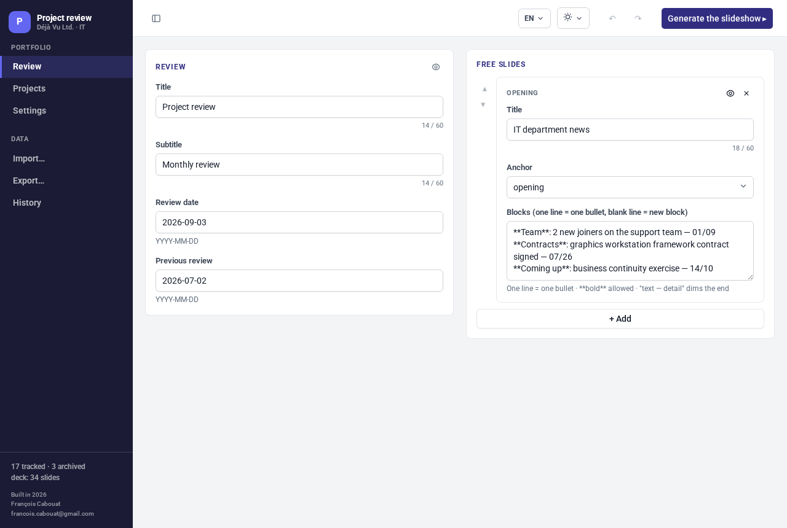
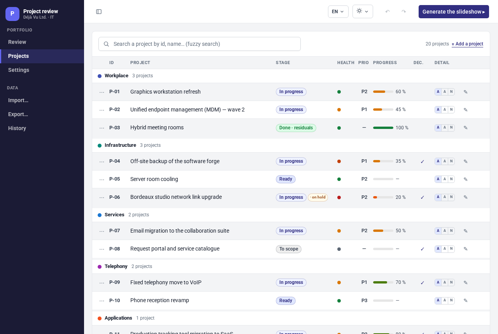
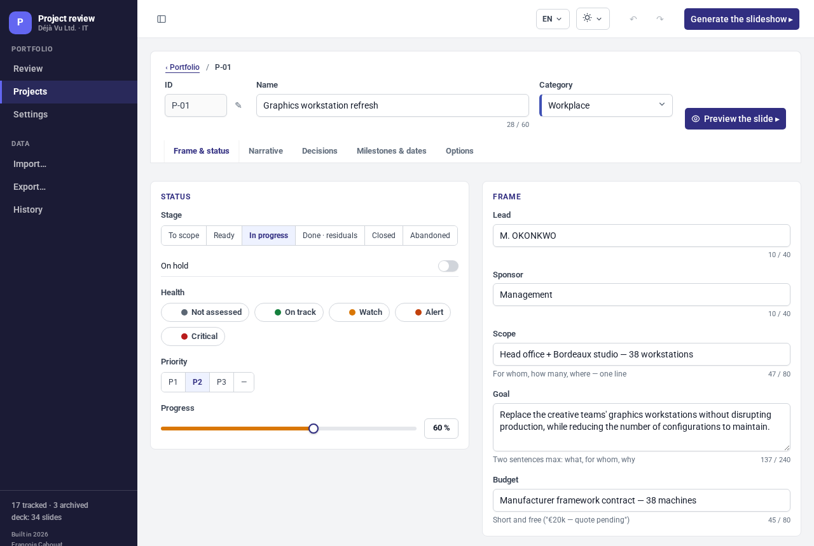
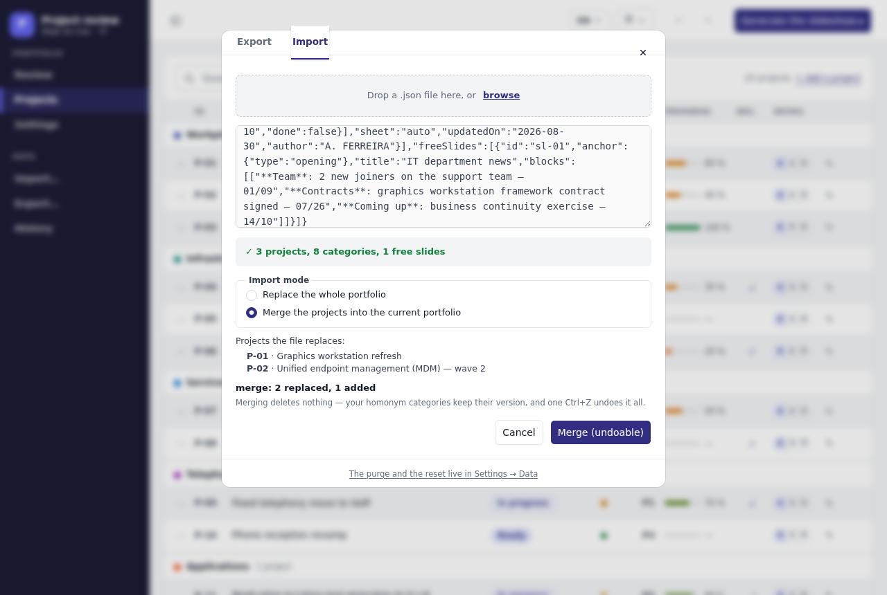
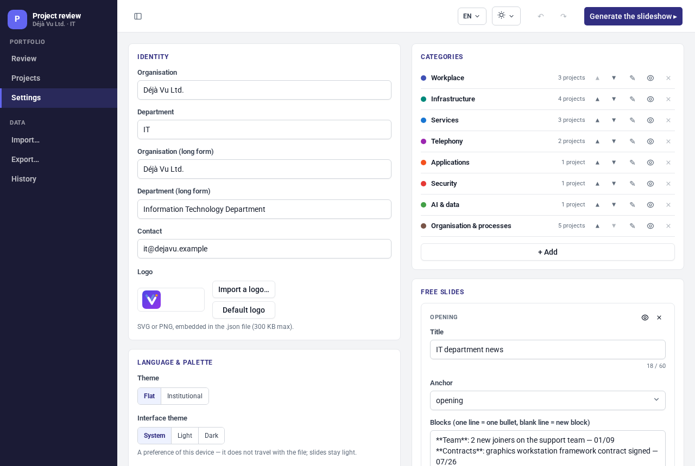
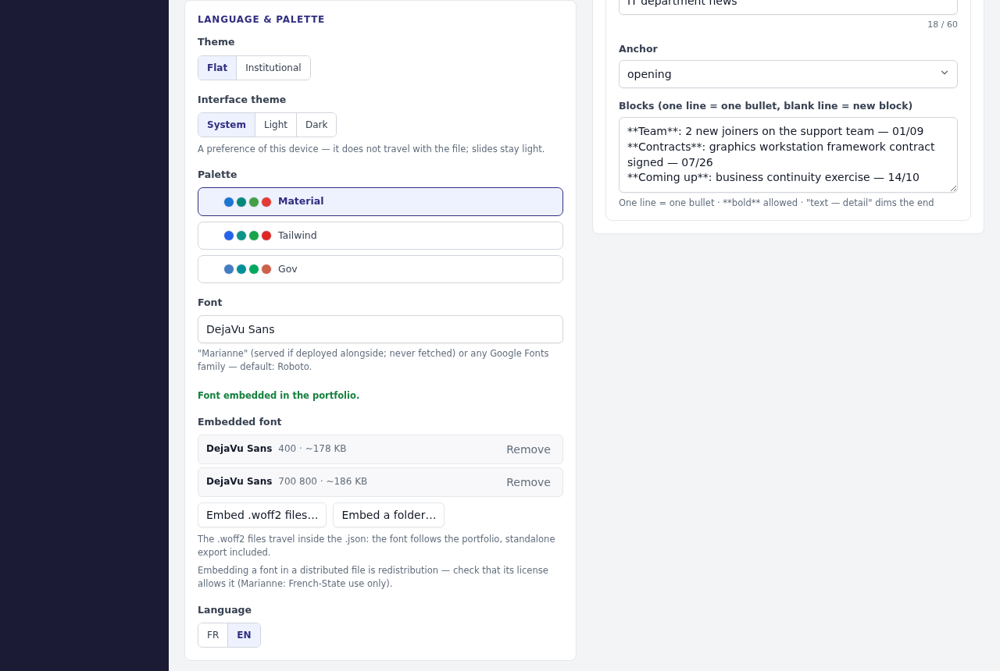

# User guide

project-review runs a monthly project review from one portfolio. You enter the
projects once; the whole slide deck — dashboards, recap table, project sheets,
decisions, archives — is derived from that data. No slide is edited by hand.

The app is one multilingual file: it starts in your browser's language
(French browsers get French, everything else English) and switches at any
time. The French version of this guide is [user-guide.fr.md](user-guide.fr.md).

## Getting started

Two ways to run the app:

- **No install.** Download `project-review.html` and double-click it. The app
  runs from `file://` — no server, no network, no account.
- **From source.** `bun install`, then `bun run dev` and open the printed URL.

The display language is auto-detected on first launch and can be switched at
any time from the language menu in the top bar (or in
[Settings](#appearance)).

## First portfolio

The app starts empty: no project, and a blank identity — on first launch,
enter your organisation (name, department, contact, logo) in **Settings**.
The review date is set to today.

To see a full example, import the Déjà Vu Ltd. sample set: 20 projects in
8 categories. The app itself carries no content — sample portfolios come with
the app (`sample-portfolio.en.json` next to the downloaded file) and with the
project site; import one through **Import…** like any portfolio file. The
import is a single history entry — Ctrl+Z undoes it. The online demo takes
the shortcut: its `?sample` address boots straight into the same set.

From there:

- **Review** holds the deck frame: title, subtitle, review dates, and the free
  slides (each with a title, an anchor position and text blocks; the
  **Move up** / **Move down** arrows reorder them).
- **Projects** lists the portfolio; **+ Add a project** creates one.
- **Settings** holds the identity, the theme, the categories, the free
  slides, the aggregate-slide switches and the data administration; every
  project belongs to one category.

Every view is an address: `#/review`, `#/projects`, `#/settings`,
`#/history` — and `#/sheet/P-01` for a project sheet. The sidebar entries are
real links, the browser's back and forward buttons walk your navigation, and a
sheet's URL can be bookmarked or shared as a deep link, even from `file://`.

## Editing

Click a project row (or its pencil button) to open its sheet. The sheet editor
has five tabs: **Frame & status**, **Narrative**, **Decisions**,
**Milestones & dates**, **Options**.

- The **⋯** button at the start of a row opens the row menu: **Move up**,
  **Move down** and **Delete** (with a confirmation).
- One field is one history entry, recorded when the field loses focus.
- Undo/redo keeps the last 500 actions: **Ctrl+Z** / **Ctrl+Y**, or the arrows
  in the top bar. Every action undoes — field edits, imports, purges; past
  500 entries, the oldest are dropped silently.
- The **History** view lists the recorded actions in business terms and shows
  the current position; clicking through it replays or unwinds the changes.
- The **Preview the slide** button (eye) renders the slide a project or a free
  slide will produce, without generating the whole deck.

## The deck

On the sample set the deck is 34 slides: an opening free slide, the title
slide, the portfolio dashboard, the health dashboard, the recap table, one
divider per category followed by the project sheets, the pending decisions,
the archives, and the record of previous decisions. All of it is derived from
the portfolio when the slideshow is generated; slides are never edited
directly — change the data instead.

Whether a project gets a detail sheet is its **Detail slide** option (Options
tab, also the A/A/N shortcuts in the project list):

- **Auto** — sheet shown when the project is ready, in progress or in
  residuals, or carries a pending decision.
- **Always** — sheet shown no matter what.
- **Never** — the project only appears in the recap.

**Settings > Aggregate slides** switches the health dashboard, the recap, the
archives and the decisions slides on or off.

## Slideshow

Click **Generate the slideshow ▸** in the top bar. Navigation works in
drawers: left and right arrows move between sections, the down arrow opens a
category and steps through its sheets. **Esc** opens the overview; a click
zooms back in.

Moving the mouse to the top edge shows a bar: **Back to the editor**,
**Overview**, **Full screen**, **Save**, **Print**, **Close**.

**Save** downloads `slideshow-{date}.html`: a standalone, read-only copy of
the slideshow. It opens from `file://` with no network and can be sent as a
single file. A font embedded in the portfolio travels inside the export;
otherwise the theme font must exist on the reader's machine, or the deck
falls back to the system stack — PDF printing, by contrast, always embeds
the glyphs.

## Printing

Click **Print** in the slideshow bar, then use the browser's print dialog to
save a PDF. The layout is A4 landscape, one page per slide — 34 pages on the
sample set. Chrome printing is the only PDF pipeline; there is no export
button.

## Import & export

**Export…** (sidebar) shows the portfolio as JSON, with a **Copy** button and
a **Download .json** button. The file is named `project-review-{date}.json`,
where the date is the review date. Checkboxes grouped by category (all
checked by default) restrict the export to the selected projects: the file is
then named `…-partial.json` and stays a valid portfolio on its own — see
[Working together](#working-together).

**Import…** accepts a dropped file, a browsed file or pasted JSON. A valid
file shows its counts (projects, categories, free slides) and offers two
modes: **Replace the whole portfolio** (the historic path) applies the file
as one undoable action, **Merge the projects into the current portfolio**
folds a colleague's contribution in — see [Working together](#working-together).
An invalid file is refused whole, with the full list of its problems — each
line points at the faulty place in the file (`projects[2].stage`, for
instance) so you can fix the file and paste it again; nothing is imported
until the file is valid.

In replace mode, the **Keep my settings and identity** checkbox (checked by
default) makes the import content-only: projects, categories, review and free
slides are replaced, while theme, logo, language and display settings are
kept. Untick it to take the whole file.

## Working together

No server needed to work as a team: everyone edits in their own copy of the
application, and the files travel however you like (mail, file share…).

1. **Hand out.** In **Export…**, tick a colleague's projects (the checkboxes
   are grouped by category) and send them the
   `project-review-{date}-partial.json` file — or the full file. A partial
   export is a valid portfolio on its own: it carries the selected projects,
   their categories, the review and your current settings.
2. **Contribute.** The colleague opens the file in their own copy of the app
   (import, replace mode), updates THEIR projects, then sends their export
   back.
3. **Merge.** Import the returned file and choose **Merge the projects into
   the current portfolio**: the preview counts the effect before anything
   happens ("merge: 3 replaced, 2 added") and lists the projects the file
   would replace. A project with a known id replaces
   yours in place, a new id joins the end of its category, an unknown
   category is created — your homonym categories keep their version, and
   nothing is ever deleted. The incoming review, settings and free slides are
   ignored.

The merge is a single history entry: **Ctrl+Z** undoes it whole.

## Data & privacy

Everything stays in the browser. There is no server and no account; nothing
leaves the machine. The one optional network call is Google Fonts, and only
when a font family that is neither bundled nor embedded in the portfolio is
chosen.

- **Local save (localStorage)** — on by default. The database and the
  undo/redo history survive a page reload. Turning it off erases the stored
  keys; the open database stays intact until the tab closes.
- **Purge the database** — empties categories, projects and free slides; the
  review and the settings are kept. Undoable.
- **Reset the settings** — back to the default theme and display; language and
  identity are kept. Undoable.

## On a phone or tablet

The editor adapts below desktop widths: the sidebar becomes a drawer behind
the ☰ button, forms stack, and the wide tables (the portfolio, the
milestones) scroll sideways inside their own frame — the page itself never
scrolls horizontally. The slideshow scales its 16:9 slides to fit the screen,
and its exit bar stays visible on touch screens. Everything works on a phone;
a desktop simply stays the more comfortable place to edit.

## Appearance

**Settings > Language & palette**:

- **Theme** — Flat (default) or Institutional. This styles the slides.
- **Interface theme** — System (default), Light or Dark. A preference of the
  device, stored outside the portfolio file: the editor chrome flips, the
  slides stay light (they are the artifact). The same three states sit in
  the top bar's scheme menu, next to the language menu.
- **Palette** — Material (default), Tailwind or Gov.
- **Font** — Roboto ships inside the app and is the default. A font embedded
  in the portfolio (see below) always wins. Marianne is used when its font
  files are deployed next to the app; with «Marianne» in the field, the card
  lists the expected files and shows a live status — embedded, served, or
  not found and falling back to the system stack. Any other Google Fonts
  family name loads from the network when one is available.
- **Language** — French or English; switching redraws the app at runtime. The
  language can also be switched from the top bar's language menu.

### Embedded font

The **Embedded font** zone of the same card embeds `.woff2` files — picked
one by one or as a whole folder — INSIDE the portfolio, as data URIs. The
variant of each file is read from its name (`Marianne-Regular.woff2` → 400,
`…-Medium` → 500–600, `…-Bold` → 700–800, `…Italic` → italic), each face is
listed with its family, weight and size, and can be removed. An embedded
family needs no deployment and no network: the app, the standalone export
and the print all use the faces carried by the file — set the **Font** field
to the family name and the status line answers «Font embedded in the
portfolio». Sizes are capped (~400 KB per face, ~1.5 MB in total) to keep
the portfolio portable.

Embedding a font in a distributed file is redistribution — check that its
license allows it (Marianne is reserved for French-State use).

To brand the deck for a French administration, pick the Gov palette and the
Marianne font here — and embed the Marianne woff2 files if your organization
may use them, so the deck carries its font everywhere.
