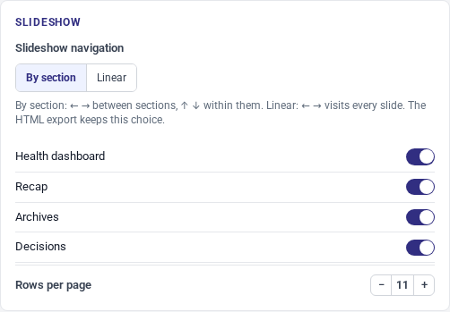

# User guide

project-review runs a monthly project review from one portfolio. You enter the
projects once; the whole slide deck — dashboards, recap table, project sheets,
decisions, archives — is derived from that data. Free slides hold optional narrative.

The app is one multilingual file: it starts in your browser's language
(French browsers get French, everything else English) and switches at any
time. The French version of this guide is [user-guide.fr.md](user-guide.fr.md).

## Getting started

To explore the app or work on your portfolio:

- **Read-only demo.** [Explore the editor with fictional data](https://fcabouat.github.io/project-review/demo/project-review.html?sample&lang=en).
  It is read-only, never reads or writes this browser's portfolio, and its
  language menu swaps the complete English/French sample.
- **Use online.** Read the [security limits](#online-security)
  before entering your own data in the full editor.
- **Standalone, offline.** Download `project-review.html` and double-click it. The app
  runs from `file://` — no server, no network, no account.

Browser storage is tied to the origin and browser profile, not an account.
Export/import JSON to move work between the online editor, local files or devices;
there is no automatic synchronization. Keep backups in either deployment mode.
For development, follow [README](../README.md), then run `pnpm run dev`.

The display language is auto-detected on first launch and can be switched at
any time from the language menu in the top bar (or in
[Settings](#appearance)).

## First portfolio

The app starts empty: no project, and a blank identity — on first launch,
enter your organisation (name, department, contact, logo) in **Settings**.
The review date is set to today.

To see a full example, import the Projay Inc. sample set: 20 projects in
8 categories. The app itself carries no content — sample portfolios come with
the app (`sample-portfolio.en.json` next to the downloaded file) and with the
project site; import one through **Import…** like any portfolio file. The
import is a single history entry — Ctrl+Z undoes it. The optional example-data
link (`?sample`) opens the same set in read-only mode. **Replace the portfolio**
restores a complete file; **Mix — choose what to import** previews changes and lets you
select review/language/identity (including logo)/theme/display blocks and then
categories, projects and free slides individually. Known identities keep the local
version unless you explicitly choose replacement or an independent copy.
Unselected items are never deleted. Appearance profiles contain only
settings and categories and can only be mixed.

<!-- Every picture in this guide is remade by one command, never by hand:
     `node scripts/stage-doc-images.mjs` — see that script's header. -->


From there:

- **Review** holds the deck frame: title, subtitle, review dates, and the free
  slides at every position: opening, before a category or closing. Each has a
  title, position and text blocks; **Move up** / **Move down** reorder slides
  at the same position.
- **Projects** lists the portfolio; **+ Add a project** creates one.
- **Settings** holds the identity, appearance, categories,
  aggregate-slide switches and data administration; every
  project belongs to one category.

Every view is an address: `#/review`, `#/projects`, `#/settings`,
`#/history` — and `#/sheet/<technical-id>` for a project sheet. The sidebar entries are
real links, the browser's back and forward buttons walk your navigation, and a
sheet's URL can be bookmarked or shared as a deep link, even from `file://`.

## Editing


Click a project row (or its pencil button) to open its sheet. The sheet editor
has five tabs: **Identity**, **Updates**, **Decisions**,
**Milestones & dates**, **Options**.


- The pencil and **⋯** buttons sit at the end of each row. The latter opens the row menu: **Move up**,
  **Move down** and **Delete** (with a confirmation).
- Changes are recorded when fields lose focus. A decision outcome commits its
  text and date together. The close/reload hook commits complete valid drafts
  before saving. Raw drafts, including incomplete or invalid input, are saved
  separately after 1.5 seconds idle, or after 10 seconds of continuous typing.
  These checkpoints add no undo steps. Reopen the same fields after reloading
  to resume editing; the model and slide exports change only on validation.
  Search filters and confirmation dialogs (such as deletion) stay temporary UI state.
  Check the save status and keep JSON backups.
- Undo/redo keeps up to 500 actions, additionally limited by a memory budget:
  **Ctrl+Z** / **Ctrl+Y**, or the top-bar arrows. Older entries are discarded.
- The **History** view lists the recorded actions in business terms and shows
  the current position; clicking through it replays or unwinds the changes.
- The **Preview the slide** button (eye) renders the slide a project or a free
  slide will produce, without generating the whole deck.

### Scope and bulk actions

Under **Identity → Scope (tags)**, enter `#site-north` or `#team-06`, then press
**Enter**, a comma or **Add**. After `#`, only `a–z`, `0–9` and `-` are accepted:
at most 63 characters and 32 tags per project. Typed uppercase letters become lowercase
and underscores become hyphens. A missing `#` is added and duplicates are ignored after
normalization. Tags already used in the portfolio are suggested to reuse a shared
vocabulary; removing a tag affects only the current project. The free-form details field
is no longer offered. Existing files may still contain `scope`: it remains readable and
is preserved on export, without implicit conversion on import. Tags appear in the
project list and summaries and are included in search.
Tags are sorted alphabetically in the editor, slides and JSON exports.
On slides, tags and metadata are limited to two display lines to preserve the layout;
the full text remains available on hover and in the JSON.

In **Projects**, choose **Select projects**, tick the desired rows or **Select all visible**,
then choose a **category** or **stage** and **Apply to selected**. Only selected projects
currently visible are affected: search-filtered rows and collapsed archives are not changed.
The whole operation can be undone in one step; bulk deletion is not offered.

## The deck

On the sample set the deck is 34 slides: an opening free slide, the title
slide, the portfolio dashboard, the health dashboard, the recap table, one
divider per category followed by the project sheets, the pending decisions,
the archives, and the record of previous decisions. All of it is derived from
the portfolio when the slideshow is generated; slides are never edited
directly — change the data instead.

Whether a project gets a detail sheet is its **Detail slide display** option (Options
tab, also the A/A/N shortcuts in the project list):

- **Auto** — sheet shown when the project is ready, in progress or in
  residuals, or carries a pending decision.
- **Always** — sheet shown no matter what.
- **Never** — the project only appears in the recap.

Buttons use these short labels; the selected mode's explanation appears underneath.

**Settings > Slideshow** switches the health dashboard, the recap, the
archives and the decisions slides on or off.

The project sheet shows the first pending decision, or otherwise the latest
settled decision and its date. The settled-decision summary covers the previous
to current review dates, both inclusive. Without a previous review date, it
includes all decisions settled up to the current review date. Archived projects
are excluded from that summary. Enable decision slides in Settings to show it.

Archive and decision tables paginate automatically. The overdue summary shows
five entries and the number of additional entries. Free slides keep every block,
but warn above three: preview dense content for overflow before distributing it.
Excessively repeated bold markers render literally; the underlying text is preserved.

## Slideshow

Click **Generate the slideshow ▸** in the top bar. In **Settings > Slideshow**,
choose **By section** (the default): left/right move between sections and
up/down traverse their slides; or **Linear**: left/right visit every slide in
order, with no vertical stacks. The choice is saved in the portfolio and kept
in the standalone HTML export. Printing and page numbering are unchanged.
**Esc** opens the overview; a click zooms back in.



When `settings.navigation` is absent from a v4 portfolio, section navigation
is used by default.


Moving the mouse to the top edge shows a bar: **Back to the editor**,
**Overview**, **Full screen**, **Save**, **Print**, **Close**.

**Save** downloads `slideshow-{date}.html`: a standalone, read-only copy of
the slideshow. It opens from `file://` with no network and can be sent as a
single file. A font embedded in the portfolio travels inside the export;
otherwise the theme font must exist on the reader's machine, or the deck
falls back to the system stack — PDF printing, by contrast, always embeds
the glyphs.

## Printing

Click **Print** in the slideshow bar, then use the browser's print dialog to
save a PDF. The layout is A4 landscape, one page per slide — 34 pages on the
sample set. Chrome printing is the only PDF pipeline; there is no export
button.

## Import & export

**Export…** (sidebar) shows the portfolio as JSON, with a **Copy** button and
a **Download .json** button. The file is named `project-review-{date}.json`,
where the date is the review date. Checkboxes grouped by category (all
checked by default) restrict the export to the selected projects: the file is
then named `…-partial.json` and stays a valid portfolio on its own — see
[Working together](#working-together).

**Import…** accepts a dropped file, a browsed file or pasted JSON. A valid
file shows its counts (projects, categories, free slides) and offers two
modes: **Replace the whole portfolio** applies the complete file as one
undoable action; **Mix — choose what to import** previews and applies only selected
blocks and collection items — see [Working together](#working-together).
An invalid file is refused whole, with the full list of its problems — each
line points at the faulty place in the file (`projects[2].stage`, for
instance) so you can fix the file and paste it again; nothing is imported
until the file is valid.

Appearance profiles contain only settings and categories and can only be mixed;
they cannot replace a portfolio. Changing the language manually changes
interface and slide labels, never your written content.

## Working together

No server needed to work as a team: everyone edits in their own copy of the
application, and the files travel however you like (mail, file share…).

1. **Hand out.** In **Export…**, tick a colleague's projects (the checkboxes
   are grouped by category) and send them the
   `project-review-{date}-partial.json` file — or the full file. A partial
   export is a valid portfolio on its own: it carries the selected projects,
   their categories, the review and your current settings.
2. **Contribute.** The colleague opens the file in their own copy of the app
   (import, replace mode), updates THEIR projects, then sends their export
   back.
3. **Mix.** Import the returned file and choose **Mix — choose what to import**.
   Nothing is selected implicitly: choose desired categories and projects, plus
   any review, language, identity, theme or display blocks. Unchecked blocks
   preserve review, identity, presentation and free slides. Unknown identities are
   added. Identical known items are skipped; differing ones offer a comparison
   and an explicit choice: keep local, take the entire incoming item or add an
   independent copy. Names and business references never establish a match.
   Select required categories or map them to local categories. Replacing a category
   also affects local projects using it. Nothing is deleted and no field-level merge occurs.

### Identities and references

New projects receive a random, stable, read-only technical identity. Exports preserve it;
inspect and copy it under **Options → Project metadata**. The business reference is
optional and reserves no column or slide space when absent. It never identifies updates.
**Last modified**, in the same section, records the local day of creation or the last
actual content edit. Unchanged values and list reordering do not update it; multiple
edits on the same day retain that date. Undo/redo restores both content and date in the
same step. Imports preserve the date carried by the file rather than using the import day.

Project leads appear in the list and below titles in summaries. Recap pagination is
capped at **6 projects per page with tags**, otherwise **10 with leads**, even when a
higher density is requested; a lower configured limit is respected.

The JSON `version` field identifies the **data format version**, independently of the
application version. The JSON schema `packages/core/samples/portfolio.schema.json`
and fictional samples are tracked in Git; the application does not add or upload personal
portfolios to the repository. Incompatible format changes require a new format version;
interface changes do not.

The current file format is **v4**. Export your portfolio before upgrading from an older
application. v3 files require a one-off external conversion; browser history and drafts
are not automatically migrated. Unreadable browser saves remain recoverable rather than
being silently erased. After conversion, share the same v4 file: converting separate old
copies would give them different identities.


The mix is a single history entry: **Ctrl+Z** undoes it whole. An appearance
profile (`project-review-appearance.json`) exports settings and categories only;
import it through Mix, never Replace.

## Data & privacy

The app does not upload portfolio contents to a server and uses no account or
application telemetry. Online, the host receives requests to load files,
requested examples and any deployed fonts. GitHub Pages logs visitor IP
addresses for security: [GitHub documentation](https://docs.github.com/en/pages/getting-started-with-github-pages/what-is-github-pages#data-collection).
The standalone file opened offline does not need these requests.

<a id="online-security"></a>

### Online use: security warning

Pages under `fcabouat.github.io` share a browser origin, even across different
repositories. A compromised script on another site of that origin could read
your portfolio, history and drafts in the same browser profile. **This does
not make the data public**, but local storage does not isolate these sites.
[Browser storage behavior](https://developer.mozilla.org/en-US/docs/Web/API/Web_Storage_API).

Do not enter confidential data on this shared deployment. Prefer the offline
file or a trusted deployment on an origin dedicated to the app, separate from
other applications and documentation catalogs. Changing only the path or storage
key is not sufficient. The offline file also relies on your device and browser
security. Keep JSON backups.

[Open the online editor](https://fcabouat.github.io/project-review/demo/project-review.html?lang=en)
for non-confidential data.

### Saving and recovery

- **Local save (localStorage)** — on by default. The database, raw drafts and
  undo/redo history are saved TOGETHER, under a single key, so an undo can
  never be replayed onto a document it does not belong to. Both survive a page
  reload. Checkpoints reduce crash losses but cannot guarantee zero loss: timers
  can be delayed and a crash can precede the next write. Imports and structural
  deletions discard obsolete drafts; edits and undo/redo of other fields preserve
  unrelated drafts. Turning the save off erases the saved copy, including drafts; the open database stays
  intact until the tab closes.
- **Quiet save feedback** — a small indicator inside an edited field reports
  pending or saved work, with an accessible label distinguishing a saved draft
  from a validated document edit. Normal saves do not add a persistent banner.
  If the browser refuses the write —
  storage full, private browsing, a restricted profile — a visible warning says so and
  offers **Download a copy** for the validated document and **Download drafts**
  for raw text not included in normal JSON exports. The latter is a rescue file
  to read/copy manually, not an importable portfolio.
- **The save switched off elsewhere** — the preference belongs to the browser,
  not to the tab. If another tab switches the local save off, yours stops
  writing and erases what it had already stored, says so and offers
  **Download a copy** — the open document stays on screen: that privacy
  choice comes back on only from **Settings ▸ Data**, and only from you.
- **Two tabs of the app** — they share one browser storage. If another tab
  saves while yours is open, yours says so at once and writes NOTHING over it:
  you choose between loading the other tab's version (undoable) and keeping
  your own. Nothing is ever merged behind your back.
- **Purge the database** — empties categories, projects and free slides; the
  review and the settings are kept. Undoable.
- **Reset the settings** — back to the default theme and display; language and
  identity are kept. Undoable.

## On a phone or tablet

The editor adapts below desktop widths: the sidebar becomes a drawer behind
the ☰ button, forms and project rows stack, and wide tables (such as
milestones) scroll sideways inside their own frame — the page itself never
scrolls horizontally. The slideshow scales its 16:9 slides to fit the screen,
and its exit bar stays visible on touch screens. Everything works on a phone;
a desktop simply stays the more comfortable place to edit.

## Appearance


The card separates interface preferences from slide appearance.

**Settings > Appearance**:

- **Interface theme** — System (default), Light or Dark. A preference of the
  device, stored outside the portfolio file: the editor chrome flips, the
  slides stay light (they are the artifact). The same three states sit in
  the top bar's scheme menu, next to the language menu.
- **Language** — French or English; switching redraws the app at runtime. The
  language can also be switched from the top bar's language menu.

**Settings > Appearance > Slide appearance** — slide theme, palette, font and
logo. These choices travel inside the `.json` file, including standalone
exports and printing.

- **Theme** — Flat (default), Institutional or Modern. This styles the slides,
  independently of the interface's light/dark scheme.

- **Palette** — Material (default), Tailwind or Uniform. It resolves the
  twelve category colours; the slides never name a colour, only a category.
- **Font** — Roboto and Inter ship inside the app; Roboto is the default. No
  font is ever fetched from a third party, so a family comes from one of three
  local sources, and the card's live status says which one applies: embedded in
  the portfolio (see below — it always wins), shipped with the app, or served
  by the deployment. For that last one, drop the woff2 into a folder named
  after the family beside the app — `fonts/<family>/<family>-Regular.woff2`,
  `…-Medium.woff2`, `…-Bold.woff2` — and the card names the exact files it
  looked for. A family none of the three covers renders on the system stack,
  and the card says so rather than leaving you to notice.
- **Logo** — your organization's mark, inlined in the file (SVG or PNG,
  300 KB max); without one the deck shows no logo at all. Nothing is bundled:
  the mark in the sample set is the sample set's own, carried in its `.json`
  like any other.

An imported palette, font or logo stays under its own rights — embedding one
in a distributed file is redistribution: check that its license allows it.
The MIT license of this software does not extend to it. The card says so once,
for the three together.

### A palette of your own

A portfolio can carry its own twelve colours instead of choosing among the
bundled families. There is no colour editor: a palette is DATA, so it comes in
with the data file. Add a `customPalette` block to `settings.theme` — an
optional `label` and a `colors` table holding exactly the twelve category
names, each an exact six-digit hexadecimal:

```json
"theme": {
  "style": "modern",
  "palette": "material",
  "font": "Roboto",
  "customPalette": {
    "label": "House colours",
    "colors": {
      "blue": "#3460d8", "indigo": "#7a4ecf", "teal": "#017661",
      "cyan": "#016770", "green": "#027a1f", "olive": "#666f02",
      "amber": "#7e5e01", "orange": "#a35301", "red": "#c52b30",
      "purple": "#a43cab", "brown": "#7d4e2c", "taupe": "#6b6456"
    }
  }
}
```

Twelve names, no more and no less: a partial table is refused at the door,
with each missing or faulty colour named at its own path. Once loaded, the
palette heads the list in the card — under your label, with a swatch preview —
and it APPLIES: the bundled families wait until you take it away. **Remove**
does exactly that, and it is undoable like every other edit.

That is how an organization hands its own colours to its colleagues: one
`.json` carrying the house palette, imported like any other file.

### Embedded font

<!-- The staging behind this one — palette + two embedded faces + logo, the
     only screen no sample set produces — lives in that same script. -->


The **Embedded font** zone of the same card embeds `.woff2` files — picked
one by one or as a whole folder — INSIDE the portfolio, as data URIs. The
variant of each file is read from its name (`…-Thin` → 100, `…-ExtraLight` →
200, `…-Light` → 300, `…-Regular` → 400, `…-Medium` → 500, `…-SemiBold` → 600,
`…-Bold` → 700, `…-ExtraBold` → 800, `…-Black` → 900, `…-Italic` → italic), each face is
listed with its family, weight and size, and can be removed. An embedded
family needs no deployment and no network: the app, the standalone export
and the print all use the faces carried by the file — set the **Font** field
to the family name and the status line answers «Font embedded in the
portfolio». Sizes are capped (~400 KB per face, ~1.5 MB in total) to keep
the portfolio portable.

To dress the deck in your organization's typography, set the **Font** field to
your house family and embed its woff2 files here, so the deck carries its font
everywhere it travels.
